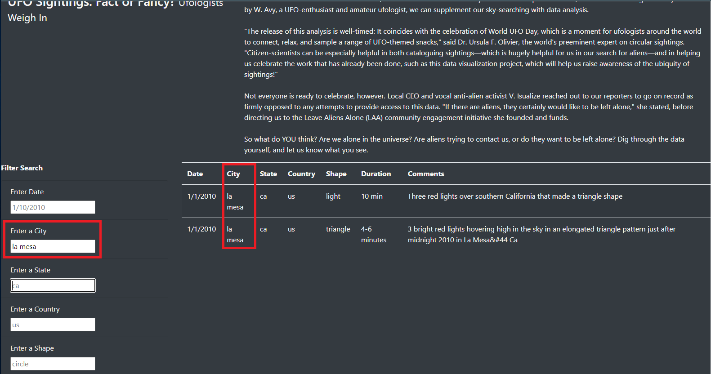
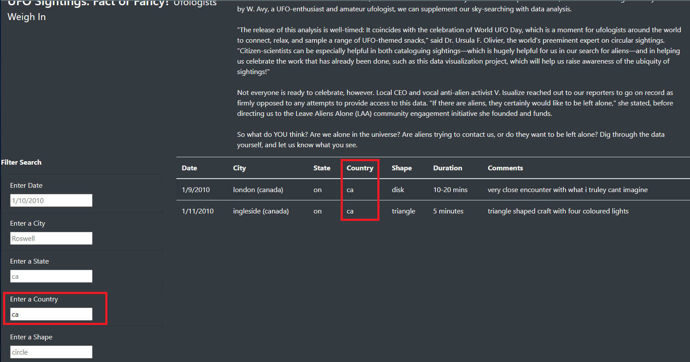

# UFOs
## Project Overview
The objective of this project is to develop a webpage that documents UFO sightings where a user could filter the results by one or more specified inputs to dynamically show results in tabular form. For this project, we used Javascript, HTML, and CSS to produce a nice-looking webpage that both reacts to user input and rescales based on the size of a screen for the end user. The page can be restored to the original layout with all filters reset by clicking on the nav bar at the top of the webpage.

## Results
The webpage header appears as follows:


Below the introduction, there is a column of filters set to help sift through the data table to the right. The filters can be found within the red box in the image below. There are filters that will restrict the table output based upon the following column headers, also in a red text box: Date, City, State, Country, Shape. No filters have been utilized in this image, the greyed out text presents an example of text to enter to enable each filter.


By entering a date using the ```m/d/yyyy``` format (or the ```m/dd/yyyy``` format for the 10th day of the month and later), you restrict the results in the data table to UFO sightings on a single day. The date filter and the Date column, showing that all results are from the same date, are highlighted below in red boxes.


By entering a city name, you restrict the results in the data table to UFO sightings from a single city. The city filter and the City column, showing that all results are from the same city, are highlighted below in red boxes.



By entering a country name as a two-letter code (either ```us``` for the United States or ```ca``` for Canada), you restrict the results in the data table to UFO sightings from a single country. The country filter and the Country column, showing that all results are from the Canada (hosers see more than the Northern Lights when they look up at the sky, eh?), are highlighted below in red boxes.



Multiple filters can be utilized, as represented in the image below using the state (using the two-letter state postal code such as ```az``` for Arizona) and shape filters. The state and shape filters are surrounded by red boxes, as are the State and Shape columns to demonstrate the uniformity of data presented when the filters are utilized.


When all five filters are utilized, we can draw down the table output to very specific results, often a single entry and frequently no entries that meet all criteria at all. The following image shows all five filters where we have restricted the table to a single UFO sighting that occurred on January 1st, 2010 in La Mesa, California, US where a triangular object was seen for 4-6 minutes around midnight. I mean, New Year's Day around Midnight? C'mon folks it was probably fireworks or a few paper lanterns. _Or was it????_


## Summary
In summary, the improvements to the filtering options for the website allow for more detailed and specific searches of the UFO data to potentially identify patterns or notable inconsistencies. This information could eventually be useful in finally answering the question of if there is indeed intelligent life is out there ([Enrico Fermi](https://en.wikipedia.org/wiki/Fermi_paradox) would like a word with all you believers, by the way).

It should be noted that the removal of the button that triggers the filtering of the data table removes a discrete and intentional event that changes the table as visualized on the webpage. A typo or data entered in the incorrect format will empty the table of all content as there are no matches, and no error checks on the filter fields. In the future, it would be optimal to incorporate a series of error pop-ups that indicate where a piece of data has not be correctly entered. In addition, because there is no persistent output for the website, it would be a nice option to allow a user to download filtered results as a .csv file if they would like to save their filtered tables and perform additional analyses.
